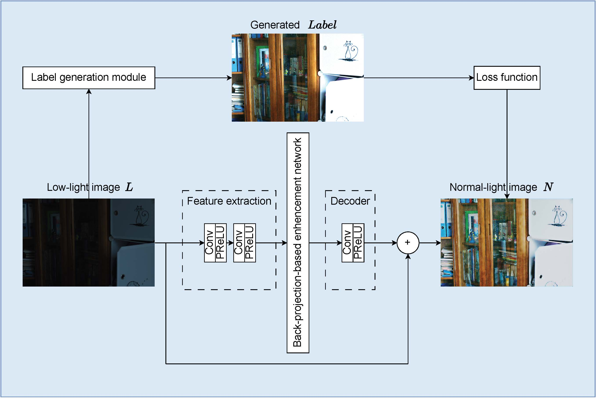
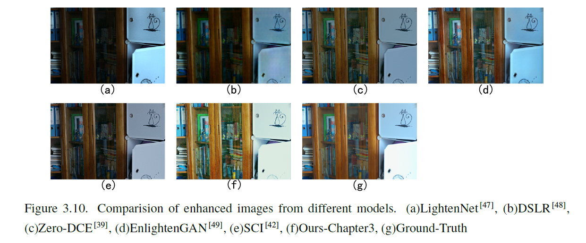
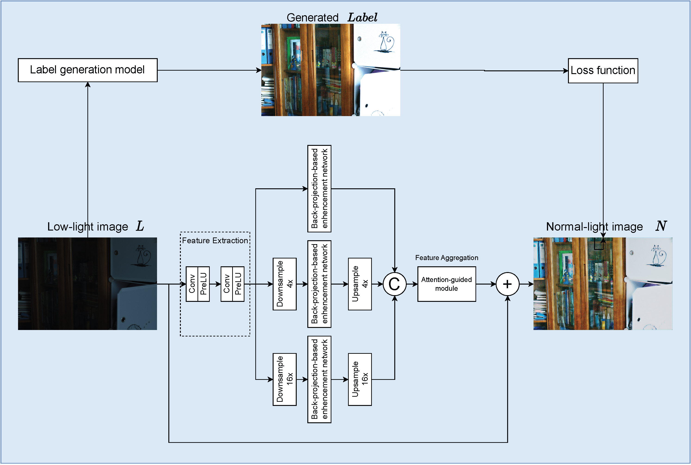
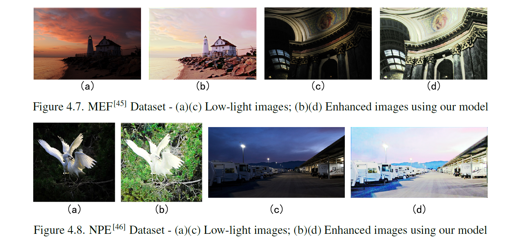

# Back-projection Network for Low-Light Image Enhancement

We suggest a method to improve low-light images without using labeled images. Our method, an unsupervised network, uses a concept called Back-projection. It works by first pulling out features from dim images. Then, it moves these features into a simulated space, learns the difference between this simulated space and the real-world one, and finally changes the simulated bright images back into real-world, well-lit images. To learn on its own, the network figures out how much to adjust the brightness of dim images using a special formula. This way, it can get better at enhancing low-light photos without needing examples of normal-light photos.

We also made the network better by adding more layers and using pyramid feature extraction and attention mechanisms to process image details more thoroughly. This didn't make training much longer but resulted in better images, improving their visual quality by an average of 3.3% on some datasets.

# Usage

`1.py` is for training

`2.py` is for quick testing (PSNR, SSIM)

`3.py` outputs image results

`4.py` evaluate running time

`model.py` consists of all networks, including ones from DLN.

`Untitled.m` measures by NIQE

`nonref.m` measures by BRISQUE

# Back-projection theory reference

Wang, Li-Wen, et al. "Lightening network for low-light image enhancement." IEEE Transactions on Image Processing 29 (2020): 7984-7996.